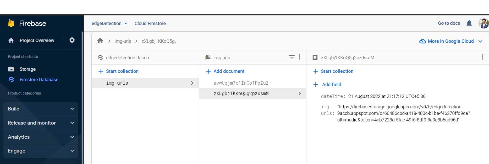
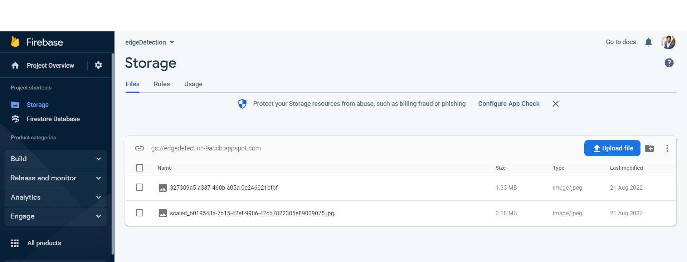

## Edge Detection flutterapp

0. Flutter / Firebase application

1. Pick Image from Gallery / Take Image from Camera
2. Store Original Image in database
3. Process the Image
4. Store Processed Image in database

## Dependencies

The following packages were used for the development of this application.

- `cloud_firestore: ^3.4.5` for storing url, with timestamp into firestore
- `firebase_core: ^1.12.0` for connecting our Flutter app to our Firebase project.
- `firebase_storage: ^10.2.8` for storing images into firebase storage
- `fluttertoast: ^8.0.9` for showing toast messages
- `image_picker: ^0.8.5+3` for picking images from gallery/camera
- `opencv_4: ^1.0.0` for using opencv libraries to work with, we used sobel operator
- `uuid: ^3.0.6` for generating unique ids for the processed images  

## DB DEMO

cloud firestore

firebase storage

<!-- 
resources referenced:
1. https://www.educative.io/answers/how-to-upload-to-firebase-storage-with-flutter
2. https://stackoverflow.com/a/64764390/17037797 
3. check op images for different derivatives : https://www.tutorialspoint.com/opencv/opencv_sobel_operator.htm 
4. https://medium.com/google-developer-experts/firebase-storage-flutter-41713c6f3e02 -->
